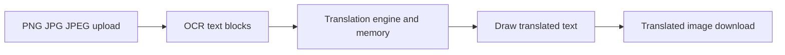

# Image Document Translation

Feature Name: image-document-translation
Updated: 2026-08-19

## Description

图片文档复用文档翻译任务、翻译引擎和记忆库检索链路。后端使用 OCR 的行级坐标识别图片文字，翻译后在对应区域绘制译文，并保存为原扩展名的输出文件。

## Architecture

## Components and Interfaces

- `TranslateDoc.vue` 扩展上传选择器、格式校验和说明文案。
- `translation.py` 提供图片扩展名判断、OCR 行块聚合、图片翻译和绘制函数。
- `translation.py` 在 DOCX、PPTX、XLSX、PDF 和图片输出路径中统一应用译文字号适配规则。
- `/api/translation/translate/file` 沿用既有异步任务接口，图片任务使用已有状态查询和下载接口。
- 部署环境提供 Tesseract 的 `eng` 与 `chi_sim` 语言数据，以及 Noto CJK 字体用于输出中文译文。

## Data Models

- 图片 OCR 块包含 `text`、`left`、`top`、`width`、`height`。
- 翻译任务的 `TranslationDoc.file_type` 保存为 `png`、`jpg` 或 `jpeg`。

## Correctness Properties

- OCR 文字块顺序和翻译输入顺序一致。
- 输出图片扩展名与原文件扩展名一致。
- 译文优先使用原字号减 1pt，空间不足时继续缩小到区域可容纳的字号。
- 图片按钮文字绘制保留按钮边框等非文字图形。
- 空白图片和 OCR 依赖缺失以明确任务错误结束。

## Error Handling

- OCR 库或语言数据不可用时返回 OCR 依赖提示。
- 无文字块时返回“未识别到可翻译文字”。
- 图片无法读取或保存时保留底层错误信息作为任务错误。

## Test Strategy

- 验证 OCR 单词数据按行合并为坐标文字块。
- 验证模拟 OCR 和翻译结果能够生成可读取的 PNG 译图。
- 验证前端校验接受 PNG、JPG 和 JPEG 扩展名。
- 验证 DOCX、PPTX、XLSX、PDF 和图片译文应用字号减 1pt 或适配缩小规则。

## References

[^1]: (translation.py#L3135) - 文档翻译异步任务入口。
[^2]: (TranslateDoc.vue#L71) - 文档上传组件。
