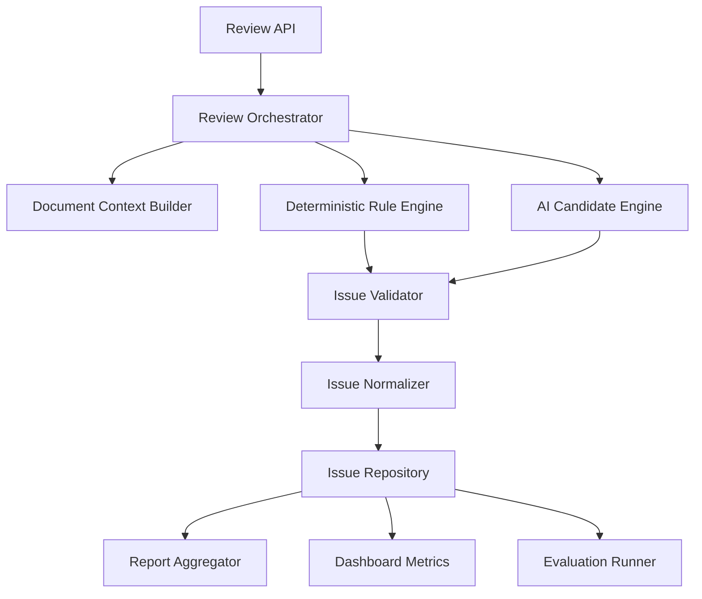

# Review Engine Refactor

Feature Name: review-engine-refactor
Updated: 2026-07-07

## Description

审核模块重构将当前集中在 `backend/app/api/review.py` 的审核流程拆分为稳定的引擎层、规则层、AI 候选层、验证层、展示层和评测层。重构目标是提升准确性、减少误报、降低 LLM 波动影响，并让每次变更可以通过固定评测集验证。

## Architecture



`Review API` 只负责 HTTP 参数校验、任务创建和进度查询。`Review Orchestrator` 负责阶段调度和诊断记录。规则和 AI 都只产生候选问题，正式问题必须经过 `Issue Validator`。

## Components and Interfaces

### Review Orchestrator

建议新增模块：`backend/app/review_engine/orchestrator.py`

职责：
- 加载文档内容和审核配置。
- 按阶段执行审核。
- 管理进度、超时、阶段诊断和异常降级。
- 输出统一的 `ReviewRunResult`。

接口草案：

```python
def run_review(document_id: int, mode: str, db: Session) -> ReviewRunResult:
    ...
```

### Document Context Builder

建议新增模块：`backend/app/review_engine/context.py`

职责：
- 清洗 PDF 文本。
- 建立章节、页码、表格行、上下文窗口索引。
- 为问题定位提供统一 API。

接口草案：

```python
class DocumentContext:
    content: str
    language: str
    file_type: str

    def locate(self, text: str) -> list[TextSpan]:
        ...

    def chapter_for(self, offset: int) -> str:
        ...
```

### Deterministic Rule Engine

建议新增模块：`backend/app/review_engine/rules/`

职责：
- 执行单位、日期、URL、产品型号、版权年份、修订历史、图表编号、交叉引用等稳定规则。
- 每条规则输出 `CandidateIssue`。
- 每条规则配套测试样例。

接口草案：

```python
class ReviewRule(Protocol):
    rule_id: str

    def check(self, context: DocumentContext) -> list[CandidateIssue]:
        ...
```

### AI Candidate Engine

建议新增模块：`backend/app/review_engine/ai_candidates.py`

职责：
- 构造严格 schema prompt。
- 分块调用 provider。
- 只返回候选问题。
- 记录 provider、耗时、返回数量和格式错误。

AI 输出 schema：

```json
{
  "issues": [
    {
      "original_text": "...",
      "suggestion": "...",
      "category": "...",
      "rule_id": "...",
      "evidence": "...",
      "confidence": 0.82
    }
  ]
}
```

### Issue Validator

建议新增模块：`backend/app/review_engine/validation.py`

职责：
- 原文定位校验。
- 建议实质差异校验。
- 敏感实体保护。
- 低价值风格建议过滤。
- 规则 ID 合法性校验。
- 严重等级归一化。

核心校验顺序：
1. 原文存在。
2. 原文可定位。
3. 建议存在且有实质差异。
4. 建议未改变敏感实体。
5. 问题类型属于允许范围。
6. 置信度达到阶段阈值。

### Issue Repository

沿用当前 `ReviewModel` 和 `IssueModel`，逐步增加诊断字段。短期可将阶段诊断存入 `Review.summary` 的 JSON，后续迁移为独立表。

建议字段：
- `pipeline_stage`
- `validation_status`
- `validation_reason`
- `display_group_key`
- `metric_scope`

### Report Aggregator

建议新增模块：`backend/app/review_engine/reporting.py`

职责：
- 将正式问题聚合为展示问题。
- 保留底层问题 ID 列表。
- 统一报告、详情页和导出文件的显示逻辑。

### Evaluation Runner

建议新增模块：`backend/app/review_engine/evaluation.py`

职责：
- 运行固定评测集。
- 对比标准答案。
- 输出检出率、误报率、一致性、耗时和退化清单。

## Data Models

```python
@dataclass
class CandidateIssue:
    source: str
    rule_id: str
    category: str
    severity: str
    original_text: str
    suggestion: str
    description: str
    audit_basis: str
    confidence: int
    position: str = ""
    chapter: str = ""
    context: str = ""


@dataclass
class ValidatedIssue(CandidateIssue):
    validation_status: str = "accepted"
    validation_reason: str = ""
    display_group_key: str = ""
    metric_scope: str = "included"


@dataclass
class ReviewStageDiagnostics:
    stage: str
    input_count: int
    output_count: int
    dropped_count: int
    duration_ms: int
    errors: list[str]
```

## Correctness Properties

- 正式问题必须能定位到文档原文。
- AI 问题必须经过后端验证后保存。
- 确定性规则结果不依赖 AI 二次判断才能进入候选集合。
- 报告聚合不删除底层正式问题。
- 看板统计使用正式问题和人工判断计算。
- 同一输入、同一配置、同一规则版本下，确定性阶段输出一致。
- AI 阶段失败时，规则阶段结果仍可完成保存。

## Error Handling

- 文档不存在：任务失败，返回明确错误。
- 文档内容为空：任务失败，提示解析内容为空。
- 确定性规则异常：记录规则 ID 和异常，继续执行其他规则。
- AI provider 超时：记录超时，使用已完成阶段结果。
- AI 输出 schema 错误：记录 provider 和解析错误，尝试下一个 provider。
- 保存问题失败：任务失败，保留阶段诊断摘要。

## Test Strategy

### Unit Tests

- `DocumentContext.locate()` 定位测试。
- 单条确定性规则测试。
- `Issue Validator` 敏感实体保护测试。
- 建议与原文无实质差异过滤测试。
- 报告聚合不丢底层问题测试。

### Integration Tests

- PDF 审核全流程。
- DOCX 审核全流程。
- AI provider 超时降级。
- 规则阶段异常隔离。
- 用户误报标记影响报告和统计。

### Evaluation Tests

- 固定评测集批量运行。
- 同一文档连续运行 3 次一致性评测。
- 误报 Top 规则统计。
- 漏检标准答案统计。

## Migration Plan

1. 新增 `review_engine` 包和数据结构，不改变 API 行为。
2. 将结果处理函数迁移到 `validation.py`，保持现有测试和复测结果一致。
3. 将确定性规则逐类迁移到 `rules/`，优先迁移单位、日期、URL、型号、版权年份和修订历史。
4. 将 AI 调用迁移到 `ai_candidates.py`，强制 schema 和 provider 诊断。
5. 将报告聚合迁移到 `reporting.py`。
6. 增加评测集和 `evaluation.py`，把审核质量纳入常规验证。
7. 精简 `backend/app/api/review.py`，保留路由、任务创建和兼容层。

## References

[^1]: `.monkeycode/docs/release-checklist.md` - 文档发布前 Checklist。
[^2]: `backend/app/api/review.py` - 当前审核 API、主流程、规则调用、AI 调用、过滤、报告和统计实现。
[^3]: `backend/app/api/review_rules.py` - 当前系统审核规则 prompt。
[^4]: `backend/app/utils/ai_client.py` - 当前 AI provider、二次验证和文档审核调用。
