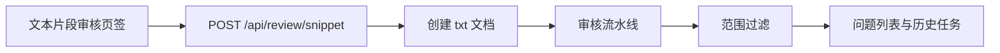

# 文本片段审核

Feature Name: text-snippet-review
Updated: 2026-08-28

## Description

开始审核页新增子页签。用户粘贴文本后，后端创建 txt 文档并以 `snippet:rule` 或 `snippet:hybrid` 模式运行现有审核流水线，最后按语法/拼写/术语过滤结果。

## Architecture

## Components and Interfaces

- `POST /api/review/snippet`: 接收 text、mode、provider
- `_is_snippet_review_mode` / `_is_snippet_scope_issue`: 识别模式并过滤问题
- `Review.vue` 子页签: 文本框、进度、查看问题

## Data Models

- Document.filename 以 `文本片段_` 开头, file_type 为 `txt`
- Review.mode 为 `snippet:rule` 或 `snippet:hybrid`

## Correctness Properties

- 片段审核结果不包含目录、结构、安全合规、交叉引用、文件名、发布前自检问题
- 单文档审核列表不展示片段文档

## Error Handling

- 空文本返回 400
- 超过 12000 字返回 400

## Test Strategy

- 单元测试覆盖模式解析和问题范围过滤
